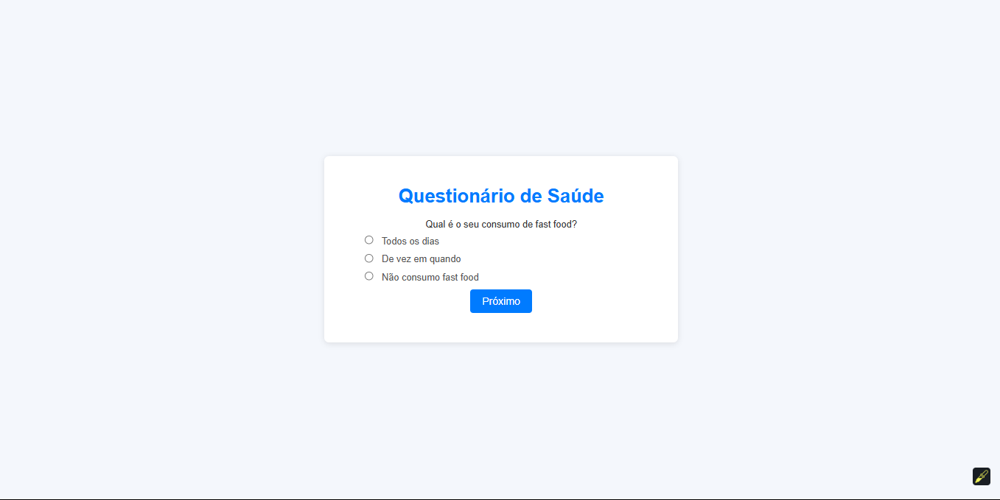

<h1 align="center"> 
    Saude-Scanner
</h1>
<p align="center">
  <a href="#-About">About</a>&nbsp;&nbsp;&nbsp;|&nbsp;&nbsp;&nbsp;
  <a href="#-Technologies">Technologies</a>&nbsp;&nbsp;&nbsp;|&nbsp;&nbsp;&nbsp;
  <a href="#-How to run">How to run</a>
</p>
<p align="center">
    
</p>

<h5 style="text-align: center"> Thank you for see !</h5>


## 📚 Sobre

Olá, espero que esteja bem! O objetivo desse projeto da universidade é voltado para a saúde e/ou bem estar, foi usado como fonte de estudo e conhecimento **Codepen**,
e canais do _YouTube_ como: **Coding With Nick**, **Eduardo Santana**, **Dear Programmer**, **The WebShala**, **CodingNepal**, além da de documentações das tecnologias
que foram utilizadas e PDF's disponibilizados pela univerdade. Com esse projeto aprendemos a estruturar e unificar nossa página com lógica com o **EJS**, atribuimos estilos
utilizando o **CSS**, estruturamos toda lógica com **JAVASCRIPT** puro junto com **Express.js** que nos ofereceu habilidades incriveis como ser
usado como ponte para criar nosso pequeno servidor feito em **Node.js**. Esse formulário realizará 5 (cinco) perguntas e ao final retornará uma
resposta de acordo com as alternativas selecionadas pelo usuário, será exibido diferentes mensagens de acordo com a lógica das perguntas respondidas, após o final do formulário trabalhamos com **SetTimeOut** de 7 segundos caso o usuário queira realizar novamente o formulário/questionário.

Para ter acesso a conteúdo similares, acesse: [Coding With Nick](https://www.youtube.com/@CodingWithNick), [Eduardo Santana](https://www.youtube.com/@edusf0), [Dear Programmer](https://www.youtube.com/@DearProgrammer), [The WebShala](https://www.youtube.com/@TheWebShala) e [CodingNepal](https://www.youtube.com/@CodingNepal)

## 🧪 Tecnologias

Esse projeto foi desenvolvido com as seguintes tecnologias:

- [HTML](https://developer.mozilla.org/en-US/docs/Web/HTML)
- [CSS](https://developer.mozilla.org/en-US/docs/Web/CSS)
- [Node.js](https://nodejs.org/en)
- [Express.js](https://expressjs.com/)
- [EJS](https://ejs.co/)

## 🚀 Como executar

Clone o projeto e acesse a pasta do mesmo.

```bash
$ git clone https://github.com/arthursj/SaudeScanner.git
$ cd SaudeScanner
$ npm install
```

Para iniciá-lo, siga o passo abaixo:
```bash
# Inicie o projeto
$ npm start
```
O app estará disponível no seu browser pelo endereço http://localhost:3000.

## 📚 About

Hello, I hope you are well! The objective of this university project is focused on health and/or well-being, and it was used as a source of study and knowledge **Codepen**,
and _YouTube_ channels such as: **Coding With Nick**, **Eduardo Santana**, **Dear Programmer**, **The WebShala**, **CodingNepal**, in addition to documentation of the technologies
that were used and PDFs made available by the university. With this project we learned to structure and unify our page with logic with **EJS**, we assigned styles
using **CSS**, we structured all the logic with **pure JAVASCRIPT** together with **Express.js** which gave us incredible abilities such as being
used as a bridge to create our small server made in **Node.js**. This form will ask 5 (five) questions and at the end will return an answer according to the alternatives selected by the user, different messages will be displayed according to the logic of the questions answered, after the end of the form we work with a **SetTimeOut** of 7 seconds in case the user wants to complete the form/questionnaire again.

To access similar content, visit: [Coding With Nick](https://www.youtube.com/@CodingWithNick), [Eduardo Santana](https://www.youtube.com/@edusf0), [Dear Programmer](https://www.youtube.com/@DearProgrammer), [The WebShala](https://www.youtube.com/@TheWebShala) and [CodingNepal](https://www.youtube.com/@CodingNepal)

## 🧪 Technologies

This project was developed with the following technologies:

- [HTML](https://developer.mozilla.org/en-US/docs/Web/HTML)
- [CSS](https://developer.mozilla.org/en-US/docs/Web/CSS)
- [Node.js](https://nodejs.org/en)
- [Express.js](https://expressjs.com/)
- [EJS](https://ejs.co/)

## 🚀 How to run

Clone the project and access its folder.

```bash
$ git clone https://github.com/arthursj/SaudeScanner.git
$ cd SaudeScanner
$ npm install
```

To start it, follow the step below:
```bash
# Start the project
$ npm start
```
The app will be available in your browser at http://localhost:3000.

--------------

Developed by :atom_symbol: [**Arthur Silva**]([arthursj (ArthurSilva) (github.com)](https://github.com/arthursj))
